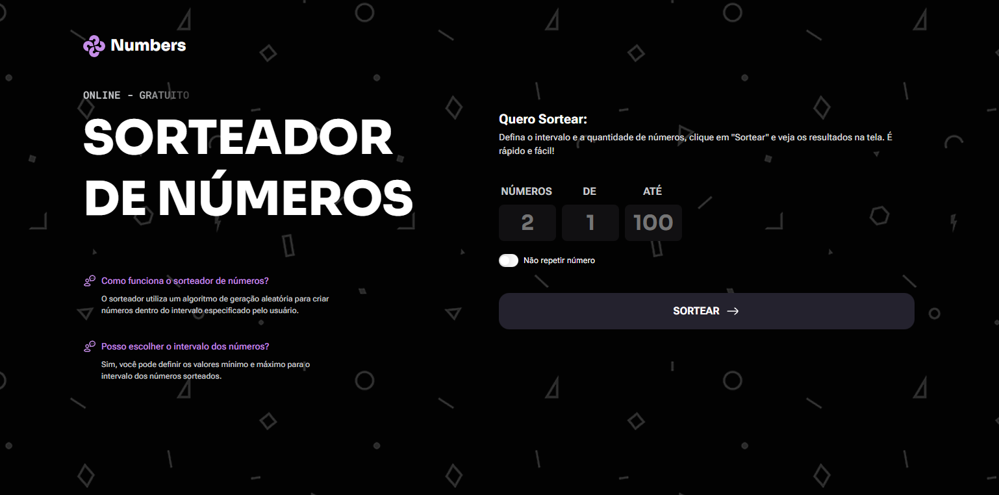

# Numbers Drawers

Um aplicativo web para sorteio de números aleatórios.



## 📋 Descrição

O Numbers Drawers é uma ferramenta simples e intuitiva que permite aos usuários sortear números aleatórios dentro de um intervalo personalizado. Ideal para sorteios, jogos, decisões aleatórias e qualquer situação que precise de geração de números randômicos.

## 🚀 Funcionalidades

- Sorteio de múltiplos números simultaneamente
- Definição de intervalo personalizado (mínimo e máximo)
- Opção para não repetir números
- Animações suaves na exibição dos resultados
- Design responsivo e moderno
- Interface em português brasileiro

## 🛠️ Tecnologias Utilizadas

### Frontend

- **HTML5** - Estrutura semântica do conteúdo
- **CSS3** - Estilização e design responsivo com organização modular
- **JavaScript** - Lógica de interação e geração de números aleatórios

### Recursos Adicionais

- **Google Fonts** - Tipografia (Inter, Roboto Flex, Roboto Mono, Sora)
- **SVG Icons** - Ícones vetoriais customizados

## 📁 Estrutura do Projeto

```
numbers-drawers/
├── index.html          # Página principal
├── script.js           # Lógica JavaScript
├── styles/             # Arquivos CSS organizados
│   ├── index.css       # Estilo principal
│   ├── global.css      # Estilos globais
│   ├── header.css      # Cabeçalho
│   ├── main.css        # Conteúdo principal
│   ├── results.css     # Resultados
│   ├── footer.css      # Rodapé
│   ├── logo.css        # Logo
│   └── utility.css     # Utilitários
└── assets/
    └── icons/          # Ícones SVG
```

## 🎯 Como Funciona

1. O usuário define a quantidade de números a sortear
2. Define o intervalo (valor mínimo e máximo)
3. Opcionalmente, pode ativar a opção "não repetir números"
4. Clica em "Sortear" e vê os resultados com animações
5. Pode sortear novamente ou reiniciar o processo

## ✨ Validações

- Impede uso do número 0
- Garante que valor máximo seja maior que mínimo
- Interface amigável com mensagens de erro claras

---

Desenvolvido por Paulo Neto em estudo da rocketseat
